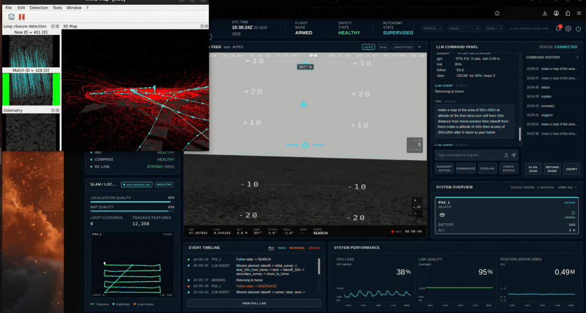

<h1 align="center">Agentic Exploration</h1>

<p align="center">
  GPS-denied autonomous navigation for a drone swarm — online LiDAR mapping,
  RTAB-Map SLAM, and A* planning over a map the vehicles build while they fly.
</p>

<p align="center">
  <a href="LICENSE"></a>
  
  
  
  
  
  
</p>

<p align="center">
  
</p>

The premise is that the drone has no global route to follow. It is given a destination, and it
has to get there using only the map it is building as it goes — replanning continuously as
obstacles resolve out of unknown space.

## Quick start

Requires Docker, an NVIDIA container runtime, an X11 display and about 20 GB of free disk. The
image is roughly 14 GB and a cold build takes 35–45 minutes.

```bash
git clone https://github.com/prasadghumare1101/Agentic-exploration.git
cd Agentic-exploration

./scripts/fetch_gazebo_models.sh    # one-time, ~580 MB of world meshes
./docker/build.sh 2>&1 | tee /tmp/build.log

AEGIS_GPS_DENIED=1 AEGIS_MODE=swarm AEGIS_DRONES=3 ./docker/run.sh
```

Then open <http://localhost:5200>.

`AEGIS_GPS_DENIED=1` is what matters here — it brings up the whole exploration stack: the shared
occupancy mapper, a per-drone A* planner, and per-drone RTAB-Map SLAM with the map viewer. Without
it the vehicles fly direct routes and none of the mapping nodes start.

The Gazebo world meshes are not in the repository — baylands alone is 393 MB — so the fetch script
is not optional. `warehouse` and `baylands` are the worlds worth exploring; `empty` gives the
planner nothing to avoid.

## Building the map

`src/perception_node/occupancy_mapper.py`

One shared node fuses **every** drone's 360° LiDAR with that drone's EKF pose into a single
occupancy grid on `/swarm/map`. One node rather than one per drone means no locks and no
cross-process shared state. The launch configures it at 1200 × 1200 cells at 1 m resolution —
±600 m, enough that long-range goals stay on-grid — published at 1 Hz to bound message load.

Each accepted scan is ray-cast into world coordinates and marked:

```python
b = yaw + ang                                   # ray bearing, CW from North
hn, he = pn + r * math.cos(b), pe + r * math.sin(b)
cell = self._cell(hn, he)
if cell is not None:
    self.grid[cell] = OCC
```

Obstacles are marked and free space is deliberately **not** ray-traced. That halves the work per
scan and is all the planner needs.

Two integration problems had to be solved before the map was usable at all:

- **QoS mismatch.** Gazebo's sensor plugins and the PX4 DDS bridge both publish `BEST_EFFORT`. A
  default reliable subscription receives *nothing* from either — the node starts, subscribes
  successfully, and no callback ever fires. Sensor subscriptions explicitly match `BEST_EFFORT`.
- **EKF initialisation glitches.** During startup the local position estimate can jump hundreds of
  metres, and ray-casting against a glitched pose paints permanent phantom obstacles far from the
  drone. Every pose update is gated on the `xy_valid` flag.

### A swarm that does not trap itself

Each drone's LiDAR sees its team-mates. Left alone, the swarm maps itself as a moving wall and
boxes itself in — the more drones, the more thoroughly they trap each other.

Returns falling within a radius of any known drone are dropped at ingest, and the swarm's own
footprint is re-cleared every publish cycle:

```python
def _clear_teammates(self):
    rad = int(self.team_radius / self.res)
    for pn, pe, _, _ in self.pose.values():
        r0, c0 = self._cell(pn, pe)
        self.grid[r0-rad:r0+rad+1, c0-rad:c0+rad+1] = FREE
```

The second pass is not redundant. It covers the startup race where marks are written before any
pose is known, and it guarantees a moving drone leaves a clear trail rather than a wall of stale
occupancy.

A decay pass then reverts any occupied cell beyond sensor range of every drone back to unknown.
This makes the map an intentionally rolling, local view: real obstacles are re-mapped as drones
approach them, while stale marks and residual phantoms can never persist at range and block
planning. It is the single change that made long-range avoidance reliable.

<p align="center">
  
</p>

## Planning on a partially-known world

`src/local_planner/local_planner.py`

The planner converts each map message into a boolean impassable mask, dilated by drone radius.
Inflation is specified in **metres and converted against the incoming message's own resolution**,
so the same planner works unchanged on the coarse 1 m LiDAR grid or a fine sub-decimetre SLAM grid.

Search is 8-connected A* with a weighted heuristic:

```python
f = ng + w * math.hypot(nr - goal[0], nc - goal[1])
```

The weight is **2.0**. An admissible heuristic expands too large a frontier to sustain the 1 Hz
replan cycle on a grid this size; inflating it makes the search substantially greedier and much
faster, and the resulting paths are marginally longer but remain strictly obstacle-free — which is
the property that actually matters.

Two details make it robust in practice:

- **The drone's own footprint is forced traversable** before every search. A single spurious
  occupancy reading beneath the airframe would otherwise block the start cell and freeze the
  planner permanently.
- **Goals beyond the map are not failures.** The planner targets the furthest free cell along the
  bearing to the true goal, flies that way while avoiding everything already mapped, and replans as
  the map grows to contain the destination. This is genuine navigation of unknown space rather than
  waypoint following.

Output is an ordinary `goto` aimed at a look-ahead point along the path, published at
`PRIORITY_NAV`. Reusing the standard action means the planner needs no special case in the
controller, outranks ordinary mission tasks while a goal is active, and yields automatically once
the goal is reached and it stops publishing.

## RTAB-Map SLAM

`src/sim_bringup/launch/rtabmap_slam.launch.py`, `src/perception_node/px4_odom_tf.py`

Each drone runs its own RTAB-Map instance, namespaced with its own TF tree
(`px4_N/map → px4_N/odom → px4_N/base_link`) so the swarm's maps never collide. Visual odometry is
off; `px4_odom_tf` republishes the flight controller's own EKF pose as `odom → base_link` plus a
`nav_msgs/Odometry` message, and RTAB-Map builds the map and point cloud from that with the 3D
LiDAR cloud fused in for geometry and scan matching.

Each drone gets its own database file — three instances sharing the default path fight over it and
fail with a lock error. Frame conversion between PX4's NED and ROS's ENU happens in one place:

```
x_enu = y_ned,  y_enu = x_ned,  z_enu = -z_ned,  yaw_enu = pi/2 - heading
```

## Autonomous missions

An operator's instruction is planned by an LLM, validated against a strict schema, and published
as a `MissionPlan`. `coordinator_node` runs it phase by phase. A `navigate` phase hands each
drone's target to its own planner on `/{drone}/nav_goal` rather than commanding a direct `goto`,
so the drone routes around whatever it has mapped:

```bash
curl -X POST "http://localhost:8000/api/mission/run?prompt=Survey%20the%20warehouse%20and%20return"
```

Natural-language missions need a Hugging Face token in a `.env` at the repository root
(`HF_TOKEN`, `HF_MODEL_ID_PRIMARY`, `HF_MODEL_ID_SECONDARY`). It is passed at run time via
`--env-file` and never enters the image. Without a token, flight and mapping still work.

## Layout

```
src/
  perception_node/        occupancy_mapper, px4_odom_tf, detector, target_follow
  local_planner/          A* over the live occupancy grid
  formation_coordinator/  mission plan executor and slot geometry
  px4_swarm_control/      drone_controller - the only node that talks to PX4
  safety_manager/         proximity, heartbeat and abort overrides
  mission_interface/      LLM planning, schema validation, supervision
  swarm_msgs/             DroneTask, DroneStatus, MissionPlan
  sim_bringup/            launch files, including rtabmap_slam.launch.py
aegis_gcs/                FastAPI control API and the web console
docker/                   Dockerfile, build and run scripts
assets/                   airframe, worlds, fallback Gazebo models
```

## Configuration

| Variable | Default | Effect |
| --- | --- | --- |
| `AEGIS_GPS_DENIED` | `0` | **Set to 1** — brings up SLAM, occupancy mapping and A* navigation |
| `AEGIS_MODE` | `single` | `swarm` for multiple vehicles |
| `AEGIS_DRONES` | `1` | Vehicle count in swarm mode |
| `PX4_WORLD` | `empty` | `warehouse` and `baylands` give the planner real geometry |

Planner tuning lives in node parameters: `inflate_radius_m` (1.5), `lookahead_m` (20),
`heuristic_weight` (2.0), and the mapper's `teammate_radius` (2.0) and `max_map_range` (12).

## Status

Built as a simulation testbed, not flight-qualified software. Two things are worth knowing:

- **RTAB-Map is not wired into the planner.** It runs for 3D mapping and visualisation, and
  avoidance runs on the LiDAR occupancy grid instead. Routing A* onto the SLAM grid needs frame
  reconciliation between RTAB-Map's per-drone map frames and the planner's shared world frame, plus
  a topic remap; that work is not finished.
- **"GPS-denied" describes what the drone plans on, not how it localises.** RTAB-Map is fed the
  flight controller's own EKF pose, so it performs mapping with known poses. The mode changes the
  vehicle from following global waypoints to routing over a map it built — it does not remove PX4
  from the state estimate.

## Built on and informed by

This project stands on a lot of open work. Direct dependencies, and the projects whose
approaches I studied while building it:

**Simulation and flight stack**

- [PX4 Autopilot](https://github.com/PX4/PX4-Autopilot) — flight control and SITL
- [PX4-ROS2-Gazebo Drone Template](https://github.com/SathanBERNARD/PX4-ROS2-Gazebo-Drone-Simulation-Template)
- [px4-ros2-gazebo-simulation](https://github.com/nhma20/px4-ros2-gazebo-simulation)

**Multi-vehicle coordination**

- [PX4_Swarm_Controller](https://github.com/artastier/PX4_Swarm_Controller)
- [px4_multi_drone_sim](https://github.com/AntonSHBK/px4_multi_drone_sim)

**Mapping and navigation**

- [RTAB-Map ROS](https://github.com/introlab/rtabmap_ros) — RGB-D and LiDAR SLAM
- [ROS 2 Navigation2](https://github.com/ros-navigation/navigation2)
- [SLAM Toolbox](https://github.com/SteveMacenski/slam_toolbox)

**Perception**

- [Ultralytics YOLO](https://github.com/ultralytics/ultralytics) — detection backbone
- [PX4-ROS2-Gazebo-YOLOv8](https://github.com/monemati/PX4-ROS2-Gazebo-YOLOv8)
- [Autonomous-Drone-Navigation-and-Human-Search](https://github.com/mirzaxbilal/Autonomous-Drone-Navigation-and-Human-Search-Algorithim)

**Language-driven control**

- [ROS-LLM](https://github.com/Auromix/ROS-LLM)
- [ChatDrones](https://github.com/Gaurang-1402/ChatDrones)
- [LLM-controlled-drone](https://github.com/pratikPhadte/LLM-controlled-drone)
- [ros2-agent-ws](https://github.com/limshoonkit/ros2-agent-ws)

## License

MIT — see [LICENSE](LICENSE).

---

Part of the same stack: [intelligent-swarm-operation](https://github.com/prasadghumare1101/intelligent-swarm-operation)
(swarm coordination and formations) · [Agentic-Hunter](https://github.com/prasadghumare1101/Agentic-Hunter)
(vision, tracking and follow).
